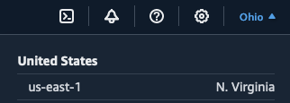
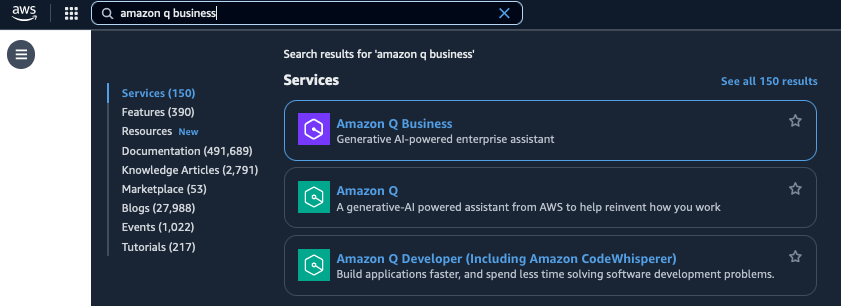
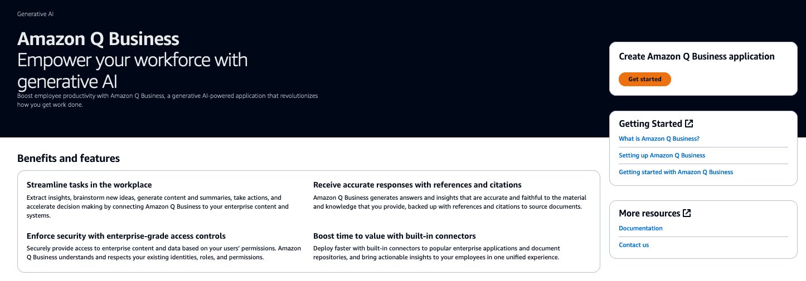

# 실습 1: Amazon Q Business 핸즈온 시작하기
## Amazon Q Business Console 둘러보기

Amazon Q Business 핸즈온 과정에서 참석해주셔서 감사합니다.

실습에 앞서 Amazon Q Business 콘솔 화면에서 어플리케이션을 생성하는 방법에 대해 먼저 살펴보겠습니다.

1. Amazon Q Business에 액세스할 수 있는 계정에 로그인합니다.

2. AWS 콘솔 상단 메뉴에서 US East(N. Virginia) 리전을 선택합니다.

3. 다음 Amazon Q Business를 검색하여 클릭합니다.

4. Amazon Q Business 서비스에서 Get Started를 클릭합니다.

5. 화면에서 Create application을 통해 Amazon Q Business를 쉽게 생성하실 수 있습니다.

