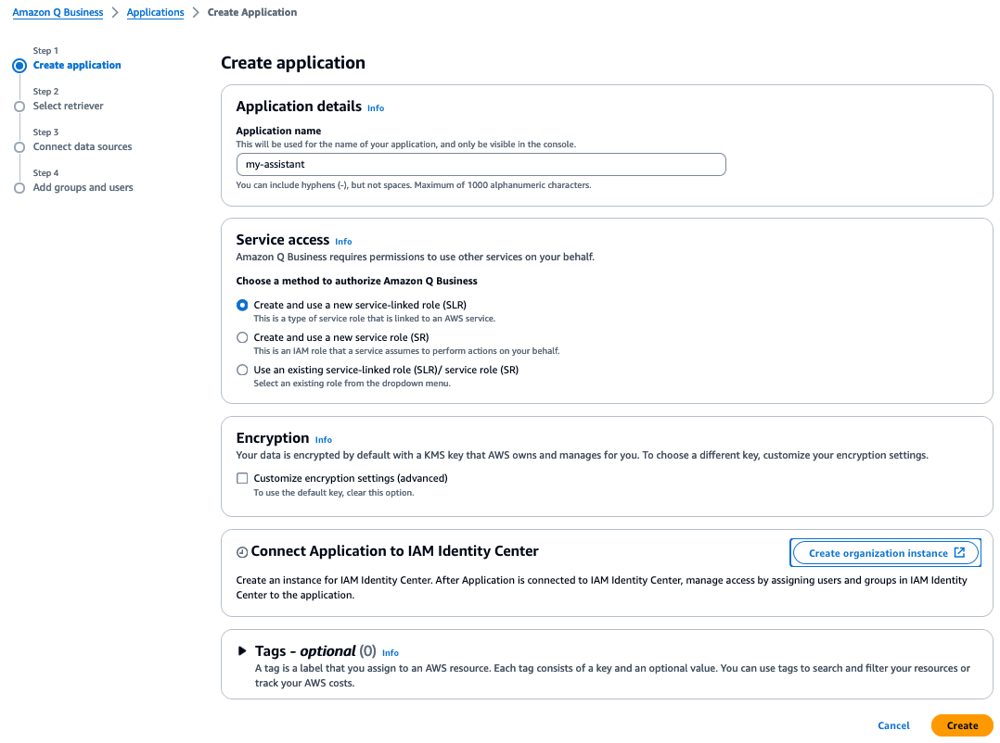
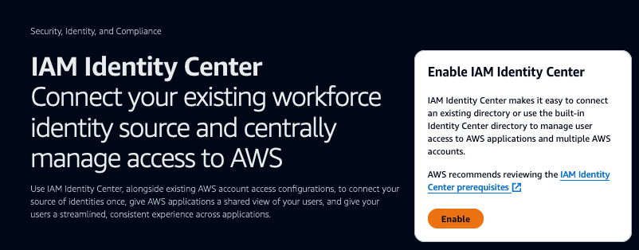
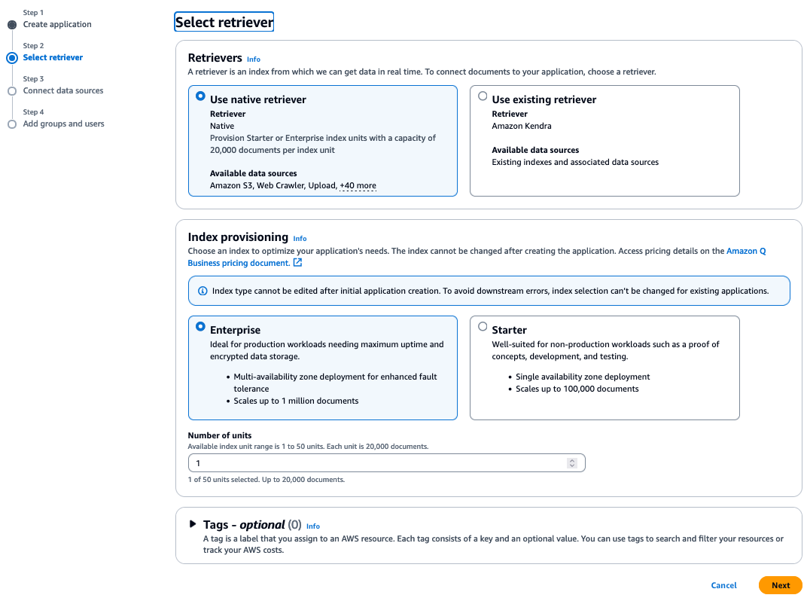
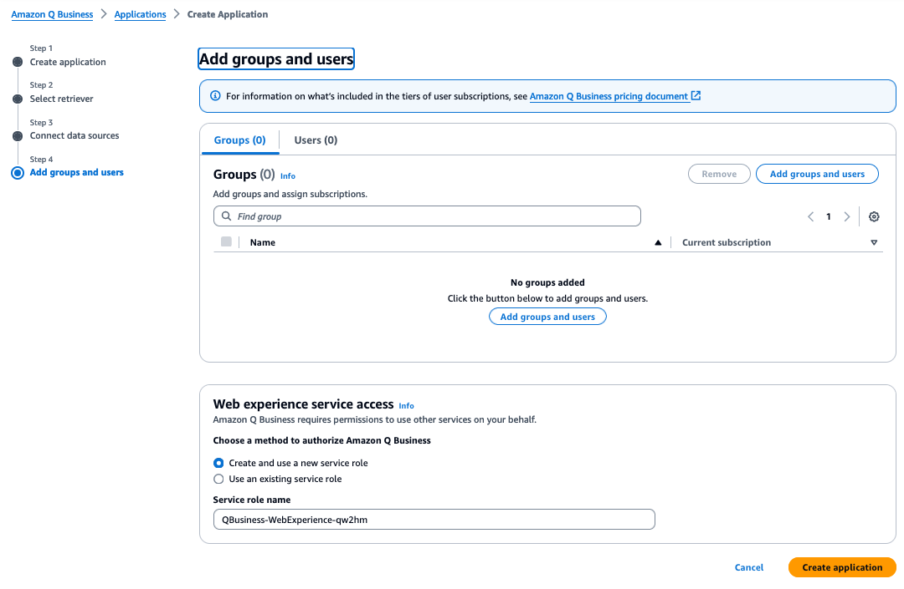
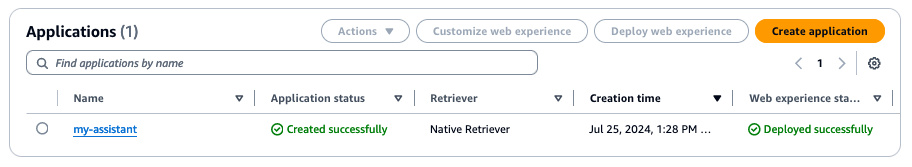

# 실습 1: Amazon Q Business 핸즈온 시작하기
## Amazon Q Business Console 둘러보기

Amazon Q Business 핸즈온 과정에서 참석해주셔서 감사합니다.

실습에 앞서 Amazon Q Business 콘솔 화면에서 어플리케이션을 생성하는 방법에 대해 먼저 살펴보겠습니다.

1. *Amazon Q Business*에 액세스할 수 있는 계정에 로그인합니다.

2. AWS 콘솔 상단 메뉴에서 *US East(N. Virginia)* 리전을 선택합니다.

3. 다음 Amazon Q Business를 검색하여 클릭합니다.

4. Amazon Q Business 서비스에서 *Get Started*를 클릭합니다.

5. 화면에서 Create application을 통해 Amazon Q Business를 쉽게 생성하실 수 있습니다.

6. Application의 이름을 기입하고 Connect Application to IAM Identity Center 왼쪽에 시계 표시가 보인다면,
   아직 IAM Identity Center가 Enable되어 있지 않은 상태이므로 오른쪽의 *Create organization instance*를 클릭합니다.

7. IAM Identity Center에서 *Enable*을 클릭합니다.

8. Application 셋팅 창을 refresh 하고 Applicationn connected to IAM Identity Center 의 왼쪽 아이콘이 check로 변경된 것을 확인 후 *Create* 버튼을 클릭합니다.

10. 검색기는 "Use native retriever"로 선택하고, Index Provisioning은 Enterprise, Number of units는 1로 설정된 것을 확인 후 *Next*를 클릭합니다.

11. Add groups and users창 오른쪽 하단 *Create application* 버튼을 클릭합니다.

12. Application이 생성된 것을 확인합니다.

