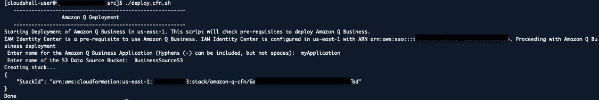
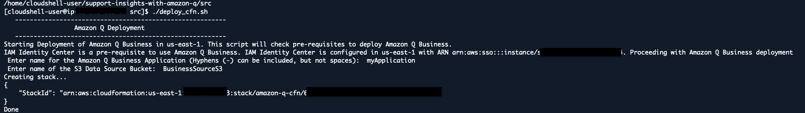

# 실습 1. Cloudshell을 통해 Amazon Q Application 생성을 위한 CloudFormation 배포하기

1. Cloudshell에 접속하여 CloudFormation 정보가 있는 Git을 Clone 합니다.
~~~
git clone https://github.com/aws-samples/support-insights-with-amazon-q.git
~~~

2. src 디렉토리에서 Cloudㄹormation 배포를 위해 deploy_cfn.sh 파일에 실행 권한을 부여하고 실행합니다.
~~~
cd support-insights-with-amazon-q/src
chmod +x deploy_cfn.sh
./deploy_cfn.sh
~~~

3. Amazon Q Business Application 으로 생성될 이름과 **00_Prerequsites.md** 를 통해서 생성한 S3 명을 입력합니다.
- Enter name for the Amazon Q Business Application (Hyphens (-) can be included, but not spaces):  **myApplication**
- Enter name of the S3 Data Source Bucket:  **businesssources3**

