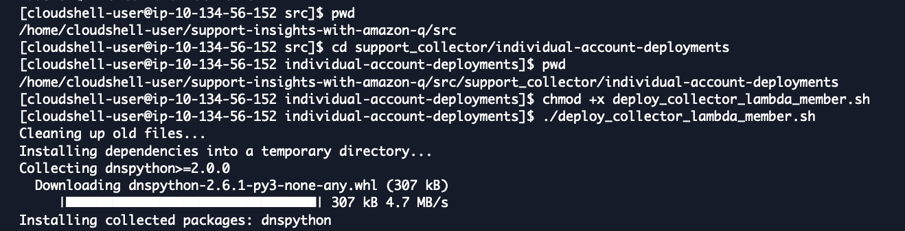
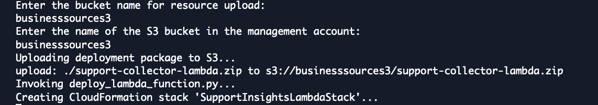
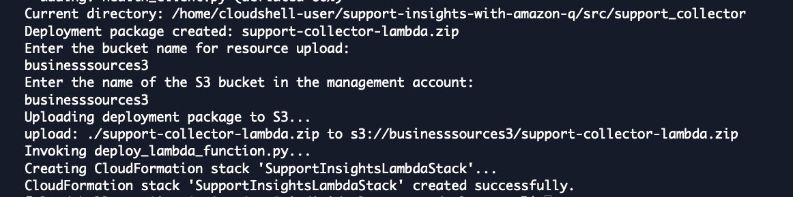
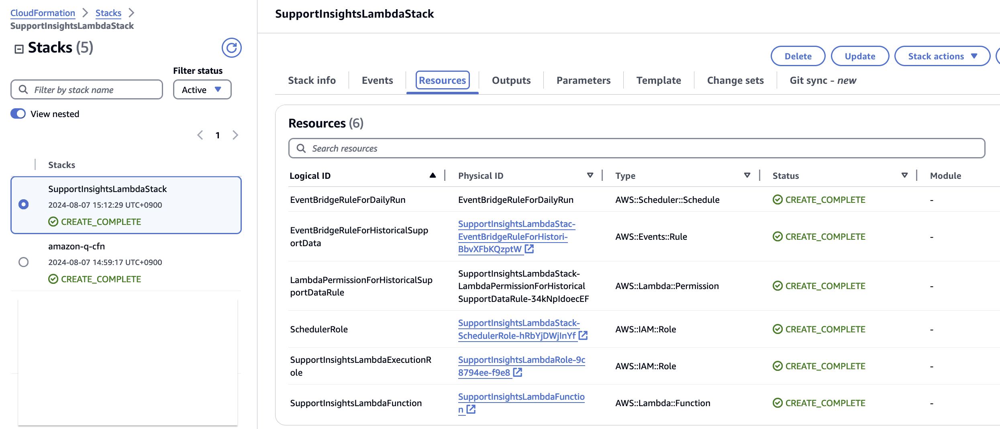

# 실습 2. Cloudshell을 통해 Support Dataset의 주기적인 저장을 위한 Lambda, EventBridge 생성

1. Cloudshell에서 다음 작업을 실행합니다.
~~~
cd support-insights-with-amazon-q/src/support_collector/individual-account-deployments
chmod +x deploy_collector_lambda_member.sh
./deploy_collector_lambda_member.sh
~~~

2. 필요한 정보를 기입합니다.
 
Enter the bucket name for resource upload: businesssources3
Enter the name of the S3 bucket in the management account: businesssources3
 

 
3. Resource 생성을 위한 CloudFormation Stackset이 배포된 것을 확인합니다.

 
4. CloudFormation에서 필요한 Stacset이 배포되고 CREATE_COMPLETE 된 것을 확인합니다.
 Event Brigdge 및 LAmbda가 생성됩니다.

