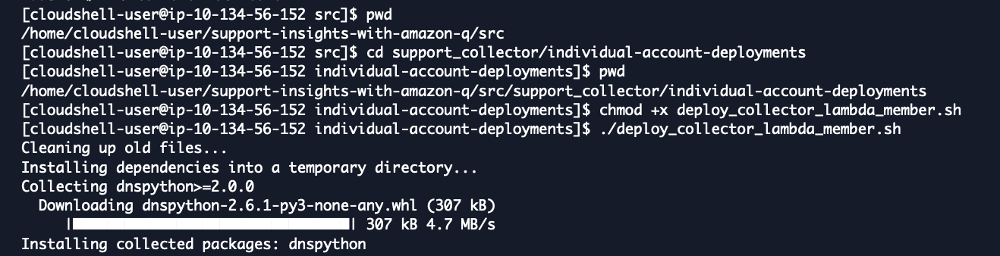

# 실습 3. Lambda를 Test하여 Support Dataset을 S3로 가져오는지 확인합니다.

1. IAM 콘솔 왼쪽 창에서 Role로 접속합니다.
~~~
cd support-insights-with-amazon-q/src/support_collector/individual-account-deployments
chmod +x deploy_collector_lambda_member.sh
./deploy_collector_lambda_member.sh
~~~

