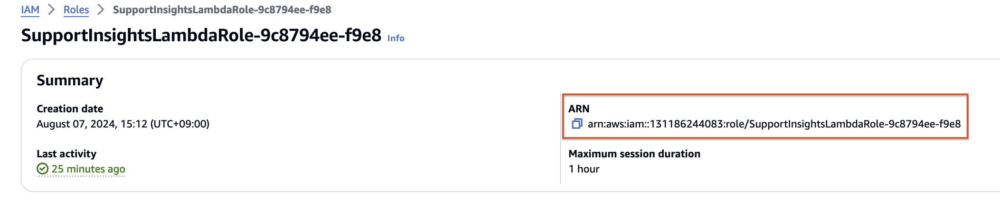
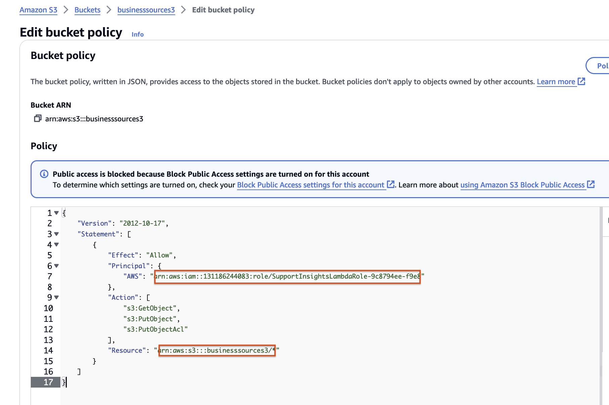
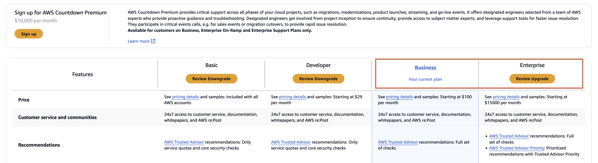
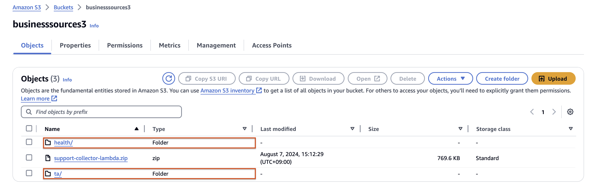

# 실습 3. Lambda를 Test하여 Support Dataset을 S3로 가져옵니다.

1. IAM 콘솔 왼쪽 창에서 Roles에서 CF Stackset으로 생성된 Roles 중 **SupportinsightsLambda** 로 검색합니다.

 
2. lambdarole의 ARN을 복사합니다.

 
3. S3 버킷으로 이동하여 Policy를 설정합니다.
* lambdarole-ARN은 2에서 복사한 정보로 붙여넣기 합니다.
* Resource는 S3의 ARN을 붙여넣기 하여 Policy를 설정합니다.

~~~
{
    "Version": "2012-10-17",
    "Statement": [
        {
            "Effect": "Allow",
            "Principal": {
                "AWS": "lambdarole-ARN"
            },
            "Action": [
                "s3:GetObject",
                "s3:PutObject",
                "s3:PutObjectAcl"
            ],
            "Resource": "arn:aws:s3:::businesssources3/*"
        }
    ]
}
~~~

4. S3로 데이터를 가져올 수 있는지 확인하기 위해 Lambda로 이동합니다.
5. SupportInsightsLambdaFunction 을 클릭하여 Test를 클릭합니다.

6. Test event 창이 열리면 Event Name을 입력하고 Event JSON에 다음과 같이 입력합니다.

 
~~~
{
  "past_no_of_days": 2,
  "bucket_name": "businesssources3",
  "case": true,
  "health": true,
  "ta": true
}
~~~
 
 
* Lambda 실행 시 다음과 같은 에러가 발생하면 Support plan이 Business 이하이기 때문에 데이터를 가져올 수 없습니다.

 
* 이 경우 Support plan을 Business 이상으로 구독하여야 진행이 가능합니다.

 
 
7. 테스트를 실행합니다.

 
8. 테스트가 잘 실행되었으면 S3에 Support Dataset이 쌓인 것을 확인합니다.

