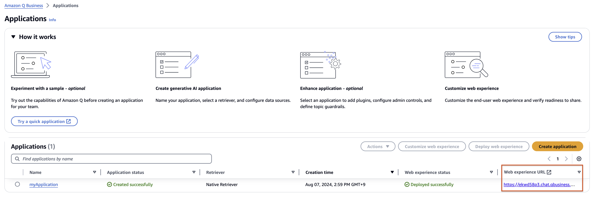
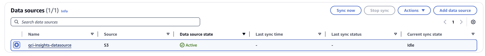
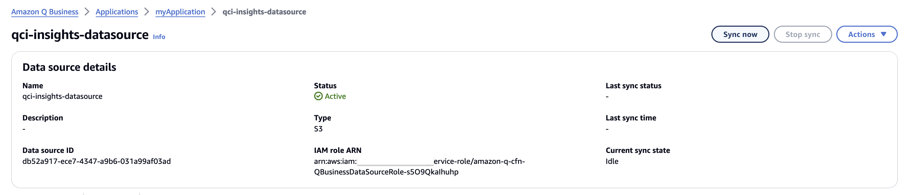

# 실습 1. Amazon Q Business S3 Resource Sync 시작

 
 
1. Amazon Q Business Application을 클릭하고 연결된 데이터 소스를 확인합니다. 

 
2. **qci-insights-datasource** 가 연결된 것을 확인할 수 있습니다.

 
3. **qci-insights-datasource** 를 클릭하고 **Sync now** 버튼을 클릭하면 Crawling과 Indexing을 시작합니다.

 

