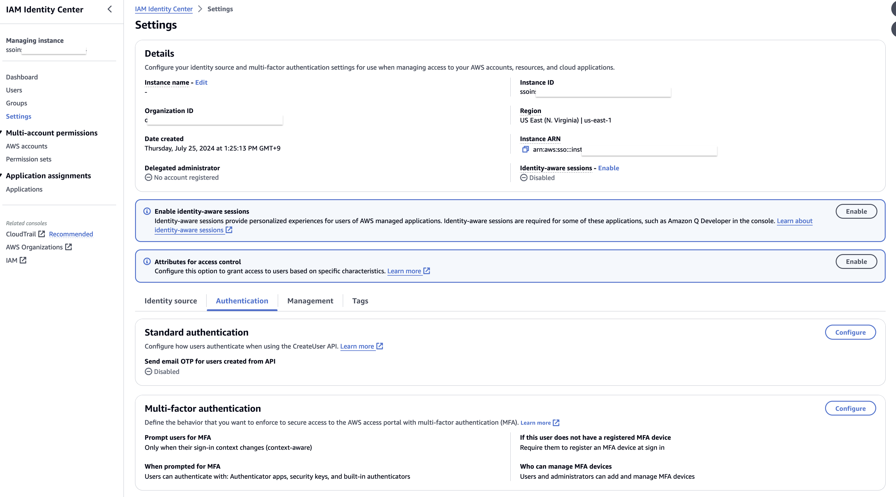
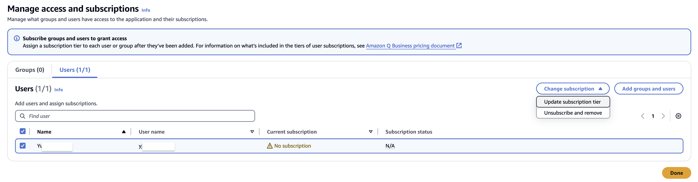

# 실습 2. Amazon Q Business 에서 사용할 유저를 생성한 후, Business Plan Pro를 구독합니다.

1. **IAM Identity Center** 를 활성화합니다.
2. **IAM Identity Center** 의 **Settings** 를 클릭하고 **Authentication Tab** 에서 **Multi-factor authentication** 의 **configure** 버튼을 클릭합니다.

 
3. **Configure Multi-factor authentication** 에서 **Never** 를 선택한 후 **Save changes** 버튼을 클릭합니다.

 
4. **Amazon Q Business Console** 로 돌아와서 Applications하단의 **Groups and users** 에서 **Manage access and subscriptions** 를 클릭합니다.

 
5. **Users** 에서 **Add or assign users and groups** 를 클릭하고 **Add or assign users and groups** 를 선택한 후 **Next** 버튼을 클릭합니다.

 
6. **Add bew users** 의 공란을 모두 기입한 후 **Next** 를 클릭합니다.
7. 생성한 유저가 표시된 것을 확인한 후, **Assign** 버튼을 클릭합니다.

 
8. 생성된 유저를 선택한 후, 오른쪽 상단의 **Change subscription** 을 클릭합니다. (구독하지 않은 상황이므로 최대한 많은 기능을 사용하기 위해 Pro로 가입합니다.)

 

