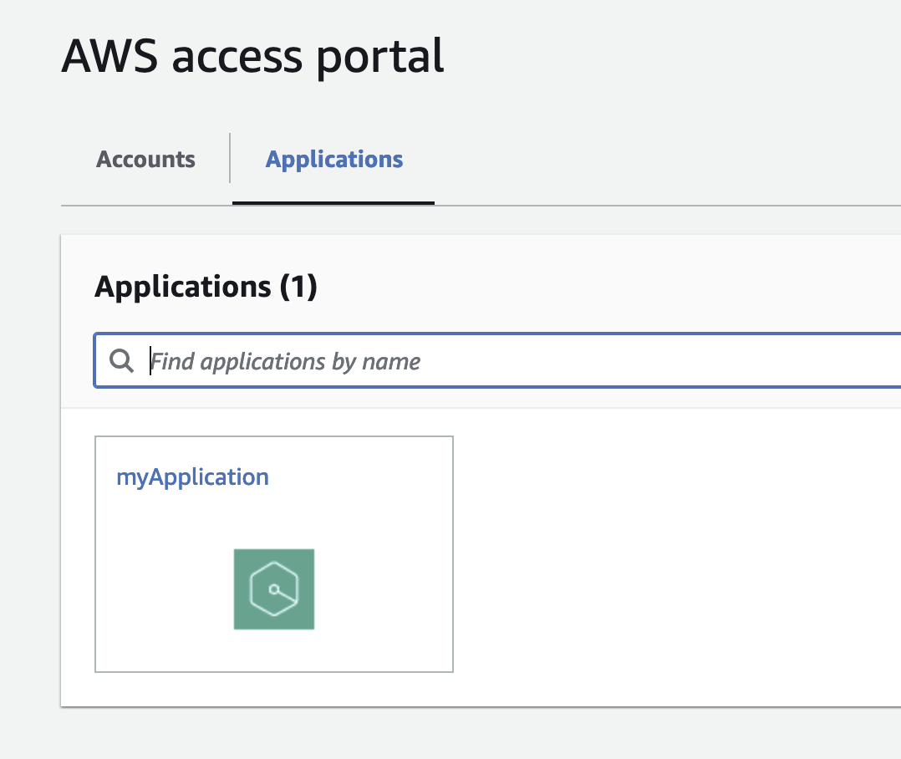
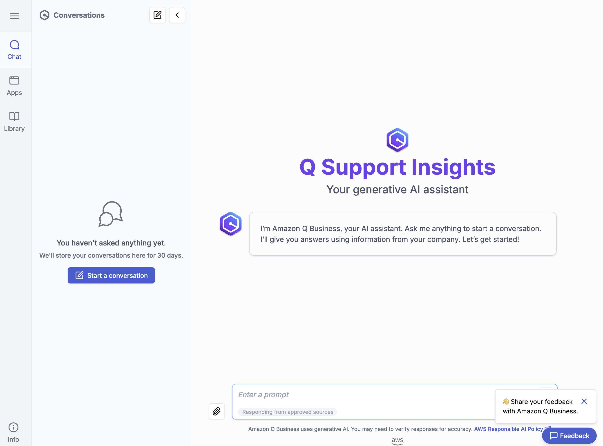
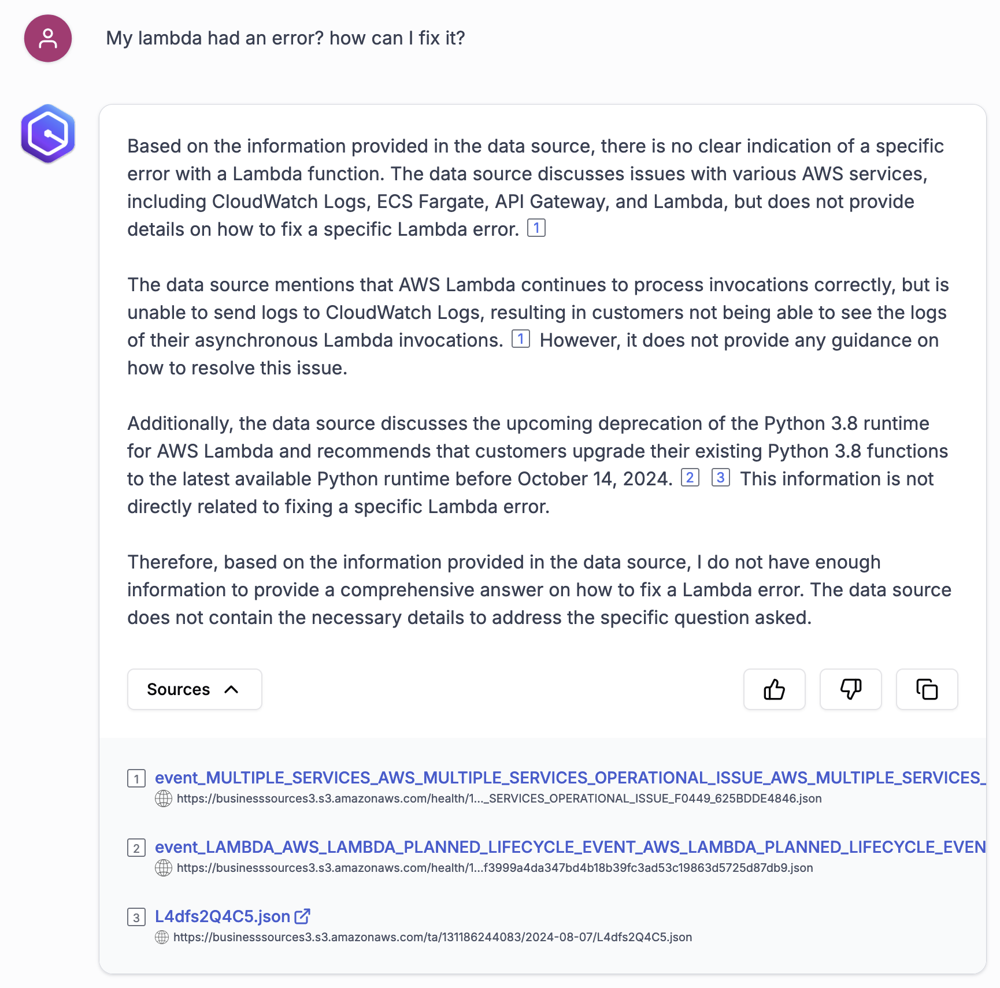
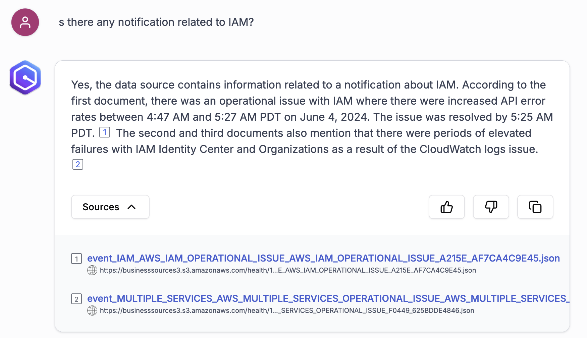

# 실습 3. Amazon Q Business 의 Web Experience에서 Prompt로 필요한 정보를 확인합니다.

1. **Applicaion** 에서 **Web Expirence** 의 **URL** 을 클릭합니다.

2. 생성한 IAM 계정으로 인증하여 App을 실행합니다.

3. Business Prompt 창이 오픈됩니다.

4. Enter a prompt 창에 질의합니다.
~~~ 
My lambda had an error? how can I fix it?
~~~

~~~
Is there any notification related to IAM?
~~~

