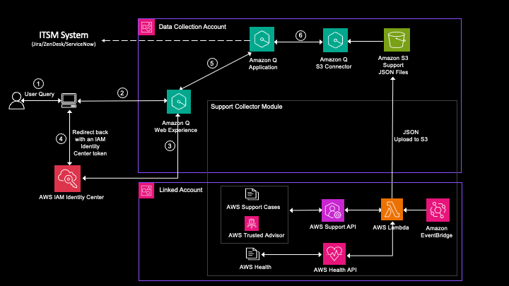

# amazon-q-business-workshop1

Amazon Q Business와 같은 AWS 생성 인공 지능(AI) 서비스를 AWS Support Case, AWS Trusted Advisor 및 AWS Status Data와 함께 사용하여 AWS를 사용하는 동안 일반적인 패턴, 문제 및 해결 방법을 찾을 수 있습니다.

Amazon Q Business는 여러 데이터 소스와 기본적으로 통합할 수 있는 43개의 커넥터를 제공합니다. 이번 실습에서는 AWS Support, AWS Trusted Advisor 및 AWS Health용 API를 사용하여 support data set에 프로그래밍 방식으로 액세스하고 Amazon Q Business 기본 Amazon Simple Storage Service(Amazon S3) 커넥터를 사용하여 support data를 색인화하고 사전 구축된 챗봇 Web experience를 통해 AWS Support, AWS Trusted Advisor 및 AWS Health API는 Enterprise Support, Enterprise On-Ramp 또는 Business 지원 플랜을 보유한 고객에게 제공할 수 있는 예제를 다룹니다.

QSI(Q Support Insights)는 코드 샘플 저장소에 제공되는 솔루션의 이름입니다. QSI를 사용하면 AWS 계정 전체의 AWS Support 데이터 세트에 대한 Insightfmf 얻을 수 있습니다. 

## Architecture Overview

<em>그림 1. QSI 솔루션 Architecture</em> 

QSI 솔루션에는 두 가지 주요 구성 요소가 있습니다. 
첫째, 그림 1의 연결된 계정 그룹에 설명된 것처럼 이 솔루션은 연결된 계정의 데이터 세트를 지원하고 다양한 API, AWS Lambda 및 Amazon EventBridge를 사용하여 데이터를 집계합니다. 
둘째, 연결된 계정의 지원 데이터 세트는 그림 1의 데이터 수집 계정 그룹에 표시된 것처럼 사용자가 소유한 중앙 S3 버킷에 저장됩니다. 그런 다음 이러한 데이터 세트는 Amazon Q Business S3 커넥터를 사용하여 인덱싱됩니다.

내부적으로 Amazon Q Business S3 커넥터는 AWS Support 데이터 세트의 검색 가능한 인덱스를 생성하고 사례 제목, 설명, 모범 사례, 키워드, 날짜 등과 같은 키워드와 관련된 중요한 세부 정보를 수집합니다. Amazon Q Business의 생성적 AI 기능을 사용하면 Amazon Q Business 웹 채팅 환경에서 사용자가 사용할 수 있는 통찰력을 종합하고 자연어 응답을 생성할 수 있습니다. 

기본적으로 Amazon Q Business는 인덱싱하는 데이터를 사용하여 응답만 생성합니다. 이 동작은 우리 솔루션과 관련된 사용 사례와 일치합니다. 필요한 경우 Amazon Q가 LLM(대형 언어 모델) 지식으로 대체할 수 있도록 이 응답 설정을 변경할 수 있습니다.
